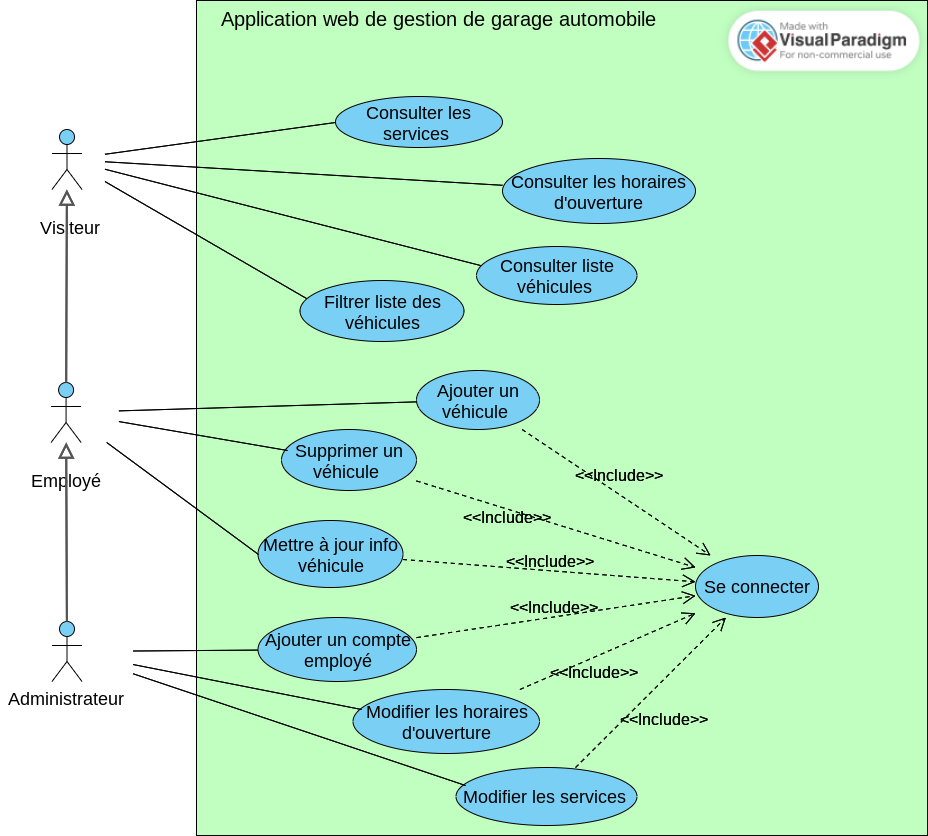
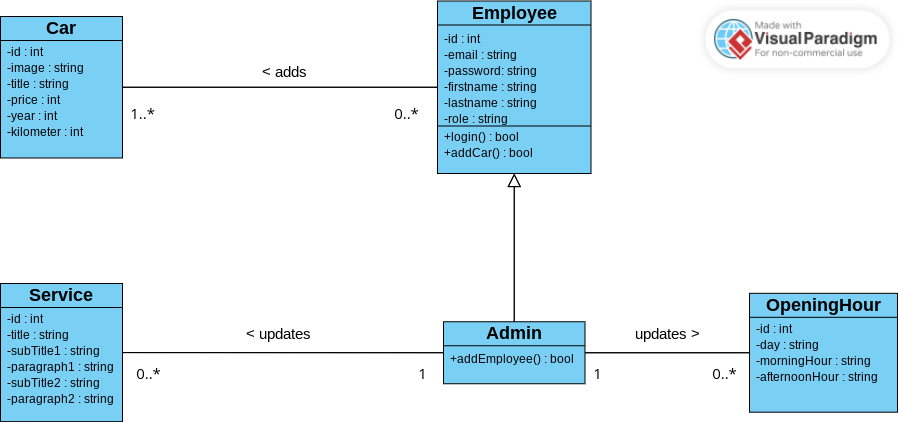

#### Voici le diagramme de cas d'utilisation de l'application:
####

#### Voici le diagramme de classes représentant le modèle relationnel de l’application:
####

#### Se connecter au compte administrateur:
- Email: vincentparrot@test.com
- Mot de passe: admin

#### Se connecter à un exemple de compte employé:
- Email: jeandupont@test.com
- Mot de passe: jeandupont

